# Complete AI Ecommerce Project Plan

**Version:** 1.0  
**Summary:** A complete project plan for an AI-powered platform that empowers small-to-medium Chinese manufacturers and brand owners to advertise, localize, and sell in the U.S. market—integrating six core agents, an orchestration layer, four extended agents, cross-cutting concerns, and adoption strategy.

This plan merges the original vision ([project_goals.md](../project_goals.md)), the structured review ([plan-review-and-format-ideas.md](../plan-review-and-format-ideas.md)), and GPT refinements into one actionable blueprint.

---

## Table of contents

1. [Vision and target users](#1-vision-and-target-users)
2. [Problem–solution fit](#2-problemsolution-fit-sharpened)
3. [Architecture overview](#3-architecture-overview)
4. [Core agents – feature list](#4-core-agents--feature-list)
5. [Extended agents – feature list](#5-extended-agents--feature-list)
6. [User adoption and engagement](#6-user-adoption-and-engagement)
7. [Competitive differentiation](#7-competitive-differentiation)
8. [Business customer user journey and agent use case](#8-business-customer-user-journey-and-agent-use-case)

---

## 1. Vision and target users

| Element | Description |
|--------|-------------|
| **Vision** | AI tool that empowers Chinese brand owners and manufacturers to advertise, refine products for target audiences, and get a professional branding strategy for the U.S. market. |
| **Users** | Small-to-medium manufacturers and brand owners in China whose main sales market is the United States. |
| **Advantages** | Users cannot afford full U.S. agency localization; local teams lack U.S. advertising expertise; even with AI tools they lack grasp of the U.S. technical and advertising ecosystem. |

---

## 2. Problem–solution fit (sharpened)

### Quantify the problem

- Research and cite how many manufacturers fail to capture U.S. share due to ineffective advertising or poor product–market fit (e.g. industry reports, surveys).
- Use this to size the opportunity and justify “why now.”

### Broader impact

- Ineffective marketing → missed customer feedback and sales → impact on bottom line and growth.
- Frame the tool as closing the loop: **better ads and listings → more feedback → better product refinement and strategy.**

### Value proposition

End-to-end, affordable, data-driven solution that replaces or reduces reliance on expensive U.S. agencies while keeping compliance and quality in check.

---

## 3. Architecture overview

Build **orchestration and product/brand context first** so every agent has a clear contract. This is the “brain” that ties components together.

```mermaid
flowchart LR
  subgraph context [Product and brand context]
    Brand[Brand guidelines]
    Products[Product catalog]
    Campaigns[Campaigns and channels]
  end
  subgraph orchestration [Orchestration layer]
    Workflow[Workflow runner]
  end
  subgraph agents [Agents]
    IK[Industry knowledge]
    I2V[Image to video]
    MM[Media management]
    CE[Customer engagement]
    AN[Analytics]
    SL[Store and listing]
    MR[Market research]
    BR[Branding strategy]
    LOC[Localization]
    LEG[Legal compliance]
  end
  context --> orchestration
  orchestration --> agents
  agents --> context
```

### Orchestration layer

- Holds **brand id**, **product id**, **campaign id**, **target channel**.
- Calls the right agents in sequence (e.g. industry knowledge → image-to-video → media management).
- Passes a **minimal context object** to each agent.

### Product/brand context

- Single place for per-brand and per-product data: brand guidelines, product names, key selling points, target audience, industries/verticals.
- All agents read from here.

### Cross-cutting from day one

| Concern | Description |
|--------|-------------|
| **Auth and multi-tenancy** | Brand owners see only their data; design with tenant id / brand id from the start (even if v1 is single-tenant). |
| **Billing and usage** | Track usage (generations, API calls) per brand/product for metering and invoicing. |
| **Content moderation and safety** | One place (or one agent) that checks generated copy and creatives against policy and platform rules before publish; reuse “claims to avoid” and do/don’t from industry knowledge. |

---

## 4. Core agents – feature list

### 4.1 Industry knowledge agent

| # | Feature |
|---|--------|
| 1 | Auto-fetch and research best practices; build and maintain a library by industry. |
| 2 | Scope industries explicitly (e.g. home goods, apparel, electronics, beauty); prioritize a short list of verticals at launch. |
| 3 | U.S. localization and compliance: ad and claim rules (FTC, platform policies), industry-specific rules (health, supplements, kids). Tag “do / don’t” by region and vertical so other agents don’t generate non-compliant content. |
| 4 | Refresh and versioning: configurable re-fetch frequency per vertical; “knowledge version” or “as of” date for traceability. |
| 5 | Output schema: minimal, stable schema (e.g. best practices, tone, claims to avoid, trending angles) consumable by image-to-video and store-listing agents. |
| 6 | Optional real-time monitoring: industry reports, trends, consumer behavior shifts, competitor marketing strategies. |
| 7 | Recommendation engine: personalized suggestions per brand owner from the library (not only a static library). |
| 8 | **Daily newsletter generation**: Automatically create and distribute daily summaries including: |
|   |   - Major platforms' rules updates (Meta, TikTok, Amazon, etc.) |
|   |   - Macro regulations updates (FTC, FDA, etc.) |
|   |   - Latest market trends: trending keywords from Reddit, TikTok, Google |
|   |   - Competitor updates: pricing changes, product modifications, new launches |
| 9 | **Quick research for new customers**: When onboarding new business customers, quickly perform web search, parse website information, and create initial industry knowledge base for their product. |
| 10 | **Customer-specific knowledge storage**: Store unique customer requirements and product information in database for personalized recommendations. |

---

### 4.2 Image-to-video agent

| # | Feature |
|---|--------|
| 1 | Produce commercial-level and authentic UGC videos; consume industry knowledge and per-video requirements. |
| 2 | Two distinct modes from the start: “authentic UGC” and “professional commercial” (separate prompt sets and optionally models). |
| 3 | **Industry knowledge integration**: Collect information from Industry Knowledge Agent daily and promptly update video creation prompts if necessary (e.g., breaking news, trending topics). |
| 4 | **Video prompt template library**: Actively or passively build video prompt templates for different purposes: |
|   |   - Product showcasing |
|   |   - Influencer advertising in selfie style |
|   |   - Professional commercials |
| 5 | **Prompt engineering updates**: Obtain latest knowledge on prompt engineering and modify video prompts to optimize output for each video LLM (Runway, Pika, etc.). |
| 6 | **Input sources**: Accept inputs of: |
|   |   - Industry-specific knowledge from Industry Knowledge Agent |
|   |   - Additional specific video requirements for each video generation |
|   |   - Product photos from brand owners |
| 7 | Brand guidelines as input: logo placement, colors, "never show X," style do's and don'ts. |
| 8 | Pre-publish check: duration, aspect ratio, no policy-breaking text/imagery; optional human-review queue for first N videos per client. |
| 9 | Budgets or caps per client/campaign (e.g. max generations per month) for pricing and cost control. |
| 10 | Emotion tuning: AI-based tuning to evoke the right emotions for the audience (e.g. warm vs energetic). |
| 11 | Adaptive learning: learn from past video performance (views, engagement) and refine generation prompts over time. |

---

### 4.3 Media management agent

| # | Feature |
|---|--------|
| 1 | **Create and manage scheduling**: Create and manage the scheduling of creatives generation from the Image-to-Video Agent. |
| 2 | **Automated upload**: Upload creatives to social platforms with pre-determined schedules set in the Branding & Strategy plan. |
| 3 | Explicit platform coverage: first platforms (e.g. Meta, TikTok, then Pinterest, YouTube); clear definition of "upload" per platform (native post, story, ad asset). Start with 1–2; add others as milestones. |
| 4 | Retry failed uploads with backoff; "failed jobs" view for brand owner to fix and re-run. |
| 5 | Content calendar (per client/brand): which creatives, which channel, which dates (table/CSV at first, later in dashboard). |
| 6 | Cross-platform scheduling: auto-adjust size and resolution per platform (Instagram, Facebook, TikTok, etc.). |
| 7 | A/B testing and optimization: manage multiple creative versions; optimize campaigns from engagement; dynamic adjustments from real-time performance. |

---

### 4.4 Customer engagement agent

| # | Feature |
|---|--------|
| 1 | **Social media response**: Respond to comments and messages on social media platforms. |
| 2 | **Lead consolidation**: Consolidate inquiries that are sales leads back to the brand owner. |
| 3 | Suggest or draft replies for approval (or post only in sandbox) until confident in safety and tone; full auto-publish as a later phase. |
| 3 | Configurable tone (friendly, formal, minimal) and escalation: when not to auto-respond (refunds, legal, complaints)—flag and route with “human reply needed.” |
| 4 | Language: English-only at first; add Chinese/mixed-language only if demand appears. |
| 5 | Clear lead definition (e.g. “where to buy,” “bulk order,” “price”) for consistent consolidation and lead-quality measurement. |
| 6 | AI-powered FAQ generator: learn from inquiries and create new FAQ content to answer new query types. |
| 7 | Sentiment analysis: classify comment sentiment (positive/negative/neutral), tailor responses, prioritize by urgency, and flag for immediate attention. |

---

### 4.5 Analytics agent

| # | Feature |
|---|--------|
| 1 | Analyze data and extract insights; new product recommendations and product feedback; dashboard for stakeholders. |
| 2 | **Live dashboard**: Generate and update live dashboard for stakeholders to monitor insights. |
| 3 | Defined data sources: platform APIs (Meta, TikTok, etc.), store (Amazon, Shopify), spreadsheets/CSVs. Start with one store + one social channel; expand in phases. |
| 4 | **Key metrics tracking**: |
|   |   - Ad spending across different platforms |
|   |   - Top performing videos |
| 5 | **Alert system**: Automated alerts for: |
|   |   - GMV dropping over X% |
|   |   - Conversion rate change in X channels |
|   |   - SKU inventories dropping low |
|   |   - Video/photo CTR dropped |
| 6 | Consistent recommendations format: e.g. trending keywords, underperforming SKUs, top creatives for dashboard and reports. |
| 7 | Scheduled dashboard refresh (e.g. daily) at first; real-time when pipelines and APIs allow. |
| 8 | Predictive analytics: predict future product performance and sales from historical data and competitor analysis. |
| 9 | A/B testing recommendations: suggest tests for ads and for product offerings and pricing. |

---

### 4.6 Store/listing management agent

| # | Feature |
|---|--------|
| 1 | Create/update listings from catalog; sync price and stock; generate and push listing copy and images to major ecommerce platforms (Amazon, Shopify, etc.). Manual approval for first-time listings. |
| 2 | Single product catalog (source of truth) mapping to Amazon, Shopify, etc.; defined field mapping (title, bullets, images, variants) and update frequency (price, inventory) to avoid overwriting manual edits. |
| 3 | Compliance and SEO: use industry knowledge (and optional “listing policy” layer) so titles and bullets meet platform rules and SEO strategy; reuse “claims to avoid.” |
| 4 | Multi-marketplace roadmap: additional platforms (e.g. Walmart, TikTok Shop, Etsy) in defined priority order. |
| 5 | Market-specific recommendations: suggest product modifications or localization (descriptions, bundling, pricing) based on U.S. trends. |
| 6 | Competitor monitoring: monitor competitor listings (pricing, reviews, strategy effectiveness) and surface to brand owners. |

---

## 5. Extended agents – feature list

### 5.1 Market research agent

| # | Feature |
|---|--------|
| 1 | Research potential U.S. market niches using consumer surveys, social listening, and trend analysis. |
| 2 | Identify high-potential target markets per brand. |

---

### 5.2 Branding strategy generator

| # | Feature |
|---|--------|
| 1 | **Create branding and strategy plan**: Generate comprehensive branding and strategy plan for brand/product. |
| 2 | **Input processing**: Input all brand's information to the agent, search for industry knowledge and competitors information. |
| 3 | **Social media plan**: Come up with a social media plan based on brand goals (long-term brand positioning or short-term goals like impressions, conversions). |
| 4 | Generate long-term branding strategies from product performance, customer feedback, and competitor analysis. |
| 5 | Include positioning, value proposition, and messaging suggestions. |
| 6 | **Goal-based planning**: Support both long-term brand positioning goals (optional) and short-term goals (get impressions, get conversions, etc.). |

---

### 5.3 Localization agent

| # | Feature |
|---|--------|
| 1 | Localize products: language (U.S. vernacular), cultural nuances, packaging design. |
| 2 | Learn from ongoing customer interactions and refine over time. |
| 3 | Work with store/listing market-specific recommendations and industry knowledge compliance. |

---

### 5.4 Legal compliance agent

| # | Feature |
|---|--------|
| 1 | Ensure compliance with U.S. advertising regulations (e.g. FTC). |
| 2 | Implement as dedicated agent or as a compliance module consuming the industry knowledge library. |
| 3 | Act as the single content-moderation/compliance check before publish; reuse “claims to avoid” and industry “do/don’t.” |

---

## 6. User adoption and engagement

| Area | Description |
|------|-------------|
| **UI/UX** | Simple, user-friendly dashboards; clear insights and actionable tasks for non-technical users. |
| **Onboarding** | Guided tour or tutorial for key functionalities. |
| **Support** | AI-driven support (e.g. live chatbot) to help users get the most from the tool. |
| **Regular updates** | Update models and knowledge (industry, trends) based on market and user feedback to stay relevant and competitive. |

---

## 7. Competitive differentiation

| Pillar | Description |
|--------|-------------|
| **Speed and cost** | Emphasize affordability and speed vs. U.S.-based agencies. |
| **Breadth** | Full stack from advertising to engagement and analytics (and, over time, market research, branding, localization, compliance). |
| **Data-driven** | Position as not only automating but **optimizing** strategies through continuous data collection, feedback loops, and recommendations. |

---

## 8. Business customer user journey and agent use case

This section outlines the step-by-step process for onboarding new business customers and how each agent contributes to their success.

### 8.1 Customer onboarding workflow

| Step | Description | Agent(s) Involved |
|------|-------------|------------------|
| **1. Collect product information** | Gather new product's unique information: | Industry Knowledge Agent |
|   | - Customer's goals and requirements | |
|   | - Unique information sources: websites, social media accounts, competitor names | |
|   | **Agent actions**: | |
|   | - Store customer's unique requirements in database | |
|   | - Quickly perform web search, parse website information | |
|   | - Create initial industry knowledge base for this product | |
| **2. Define goals** | Ask for long-term or short-term goals: | Branding & Strategy Agent |
|   | - Long-term brand positioning and goals (optional) | |
|   | - Short-term goals: get impressions, get conversions, etc. | |
|   | **Agent actions**: | |
|   | - Input all brand's information to the agent | |
|   | - Search for industry knowledge and competitors information | |
|   | - Come up with a social media plan | |
| **3. Create initial videos** | Ask for product photos and create first set of videos | Image-to-Video Agent |
|   | **Agent actions**: | |
|   | - Collect information from Industry Knowledge Agent daily | |
|   | - Promptly update each day's video creation if necessary (e.g., breaking news) | |
| **4. Schedule and upload** | Automatically upload videos to desired social media platforms on schedule created in step 2 | Media Management Agent |
|   | **Agent actions**: | |
|   | - Execute scheduled uploads based on plan from Branding & Strategy Agent | |
| **5. Show centralized data** | Display analytics and insights | Analytics Agent |
|   | **Agent actions**: | |
|   | - Generate live dashboard | |
|   | - Provide insights and recommendations | |
|   | - Alert on key metrics changes | |

### 8.2 Continuous engagement

After initial setup, agents work continuously:
- **Industry Knowledge Agent**: Daily updates and newsletter distribution
- **Customer Engagement Agent**: Real-time response to comments and messages, lead consolidation
- **Analytics Agent**: Continuous monitoring and alerting
- **Image-to-Video Agent**: Regular video generation based on performance and trends

